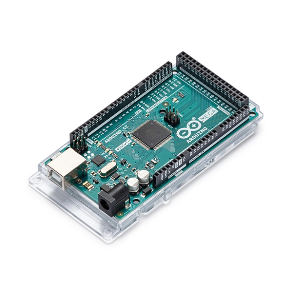
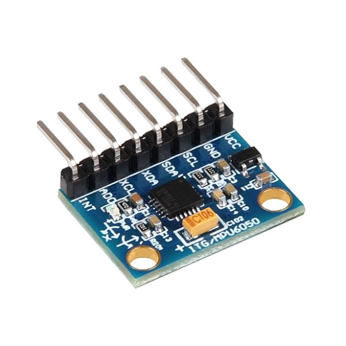
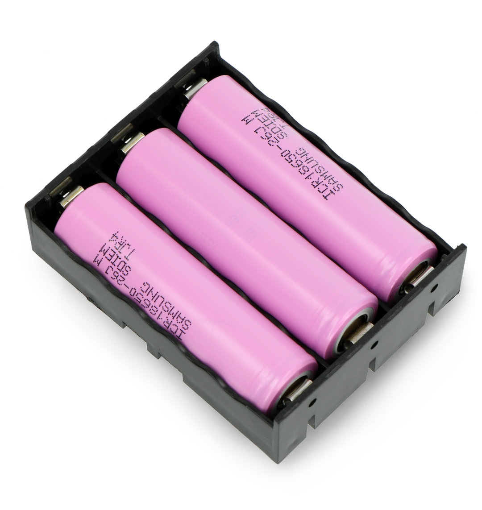
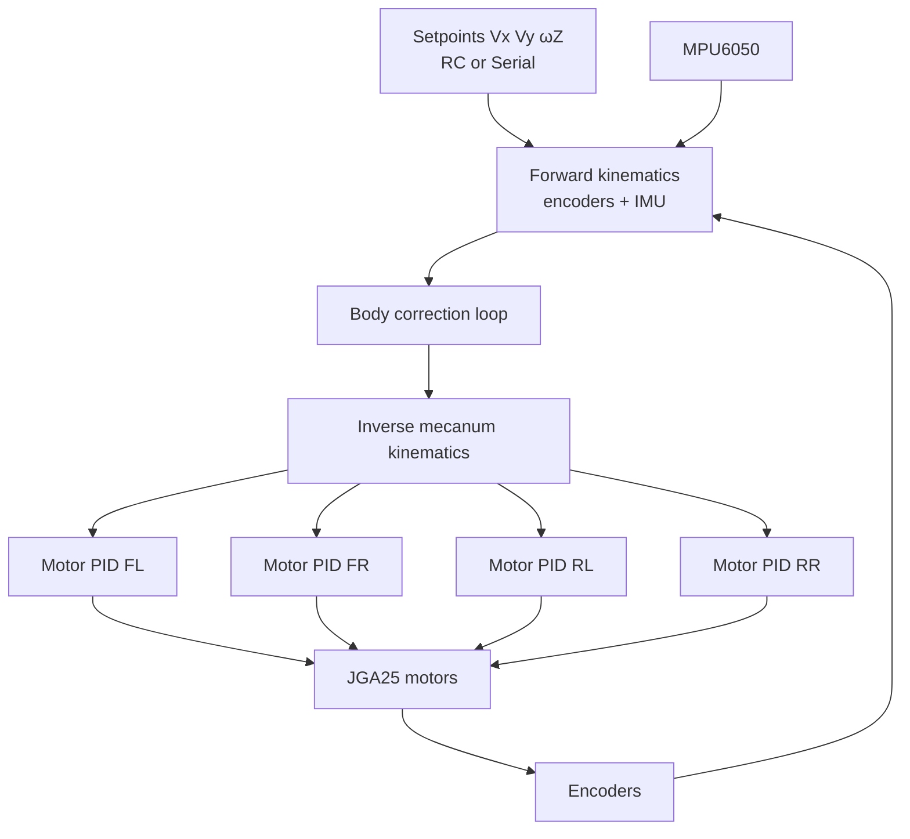
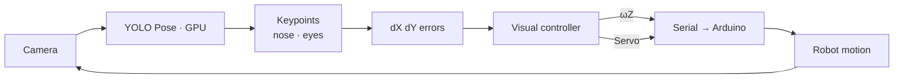

# RC Mecanum Car — Autonomous Face Tracking

> Omnidirectional mecanum-wheeled vehicle, radio-controlled or autonomously driven by GPU-accelerated vision.

End-to-end mobile robotics project: real-time embedded control, omnidirectional kinematics, sensor fusion, and on-device face tracking on Jetson.

---

## Overview

The system is built on **two coupled layers**:

| Layer | Hardware | Role |
|-------|----------|------|
| **Low-level control** | Arduino Mega 2560 | Motors, encoders, IMU, RC radio decoding |
| **Perception & behavior** | NVIDIA Jetson | Face detection, motion command generation |

**Two operating modes:**

- **Manual** — CRSF (Crossfire) radio control, sticks mapped to mecanum velocities (`Vx`, `Vy`, `ωZ`)
- **Autonomous** — camera detects a face and continuously adjusts chassis orientation and camera tilt to keep it centered in frame

---

## Key Components

| | | |
|:---:|:---:|:---:|
|  |  |  |
| **Arduino Mega 2560** — real-time control | **Jetson Nano** — perception & AI | **MPU6050** — IMU (yaw, yaw rate) |

| | | |
|:---:|:---:|:---:|
|  |  |  |
| **JGA25 + mecanum wheel** — 4× encoded motors | **USB camera** — capture & tracking | **Taranis X-Lite** — CRSF teleop |

| | | |
|:---:|:---:|:---:|
| |  | |
| | **18650 pack** — onboard power | |

---

## Skills Demonstrated

| Domain | Highlights |
|--------|------------|
| **Mobile robotics** | Mecanum forward/inverse kinematics, cascaded PID loops (wheel → body) |
| **Real-time embedded** | Multi-rate control loops, encoder interrupts, IMU DMP pipeline |
| **Teleoperation** | CRSF protocol decoding, stick-to-velocity mapping |
| **Computer vision** | YOLO pose detection, facial keypoint extraction, visual servoing |
| **Edge AI** | GPU inference on Jetson (PyTorch + CUDA, Ultralytics) |
| **System integration** | Jetson ↔ Arduino serial protocol, manual / autonomous mode switching |

---

## Hardware & Stack

### Platform

- **4× JGA25 motors** with quadrature encoders — omnidirectional mecanum base
- **H-bridges** — direction + PWM per motor
- **MPU6050** — IMU with DMP pipeline (quaternion → yaw, yaw rate)
- **CRSF receiver** — low-latency radio link for teleoperation
- **Camera servo** — vertical tilt independent of chassis

### Compute & Software

| Component | Technology |
|-----------|------------|
| Embedded control | Arduino Mega 2560, C++ |
| Perception | NVIDIA Jetson, Python |
| Vision | OpenCV, Ultralytics YOLO pose |
| AI acceleration | PyTorch, CUDA |
| Inter-board link | USB serial (`/dev/ttyACM*`) |

---

## System Architecture

```
┌──────────────────────────────────────────────────────────────┐
│                         JETSON                               │
│                                                              │
│   USB Camera ──► YOLO Pose (GPU) ──► facial keypoints        │
│                         │                                    │
│                         ▼                                    │
│              dX / dY errors (image center)                   │
│                         │                                    │
│                         ▼                                    │
│              ωZ setpoint + camera servo angle                │
└──────────────────────────┬───────────────────────────────────┘
                           │ USB serial  (X, Y, Z, S)
┌──────────────────────────▼───────────────────────────────────┐
│                      ARDUINO MEGA                            │
│                                                              │
│   CRSF (manual) ──┐                                          │
│                   ├──► Vx, Vy, ωZ setpoints                  │
│   Serial (auto) ──┘           │                              │
│                               ▼                              │
│              forward kinematics (encoders + IMU)             │
│                               │                              │
│                               ▼                              │
│              body correction loop (Vx, Vy, yaw)              │
│                               │                              │
│                               ▼                              │
│              inverse kinematics → 4 wheel speeds             │
│                               │                              │
│                               ▼                              │
│              4× motor PID → PWM + direction                  │
└──────────────────────────────────────────────────────────────┘
```

---

## Embedded Control (Arduino)

Firmware in `arduino/rc_control/` handles all low-level control with **multi-rate loops**:

| Loop | Rate | Role |
|------|------|------|
| Encoder sampling | 100 Hz | Per-wheel angular velocity estimation |
| PID control | 10 Hz | Kinematics + correction + actuation |
| IMU | event-driven | Yaw / yaw-rate update (DMP FIFO) |

### Cascaded Control

Control is organized in **two levels**:

1. **Outer loop (body)** — regulates `Vx`, `Vy`, and heading / yaw rate `ωZ` from wheel odometry + IMU
2. **Inner loop (wheels)** — 4 independent PIDs convert angular velocity setpoints to motor PWM, with feedforward model



### CRSF Teleoperation

Radio sticks are normalized to `[-100, 100]` and mapped to mecanum commands. Auxiliary channels handle arming and mode switching.

---

## Face Tracking (Jetson)

Script `source/car_core.py` implements the **visual servoing** loop:

### Pipeline

1. **Capture** — USB camera stream via OpenCV
2. **Inference** — YOLO pose model (`pose_estimator_preloaded.pt`) on GPU
3. **Selection** — primary subject filtering (confidence + keypoint consistency)
4. **Extraction** — nose + eyes → `dX` (horizontal) and `dY` (vertical) offset from image center
5. **Control** — conversion to `ωZ` (chassis rotation) and servo angle (camera tilt)
6. **Output** — compact serial protocol to Arduino (`Z...` for ωZ, `S...` for servo)



**Deadbands** (`threshold_dX`, `threshold_dY`) reduce jitter. On target loss, a search behavior re-acquires the face.

---

## Repository Structure

| File / folder | Description |
|---------------|-------------|
| `arduino/rc_control/rc_control.ino` | Main loop, RC, IMU, serial parser, servo |
| `arduino/rc_control/Car.cpp` | Mecanum kinematics + body correction |
| `arduino/rc_control/Motor.cpp` | Per-wheel PID, encoder speed estimation |
| `arduino/rc_control/MPU_handler.cpp` | Yaw / yaw-rate extraction from DMP |
| `source/car_core.py` | Face tracking, command generation, serial link |
| `models/` | YOLO pose model weights |

---

## Demo

<!-- Video or GIF link -->
`[Demo video](docs/demo.mp4)` · `[Tracking GIF](docs/demo.gif)`

---

*Experimental platform — each subsystem validated independently, initial tests with wheels off the ground.*
