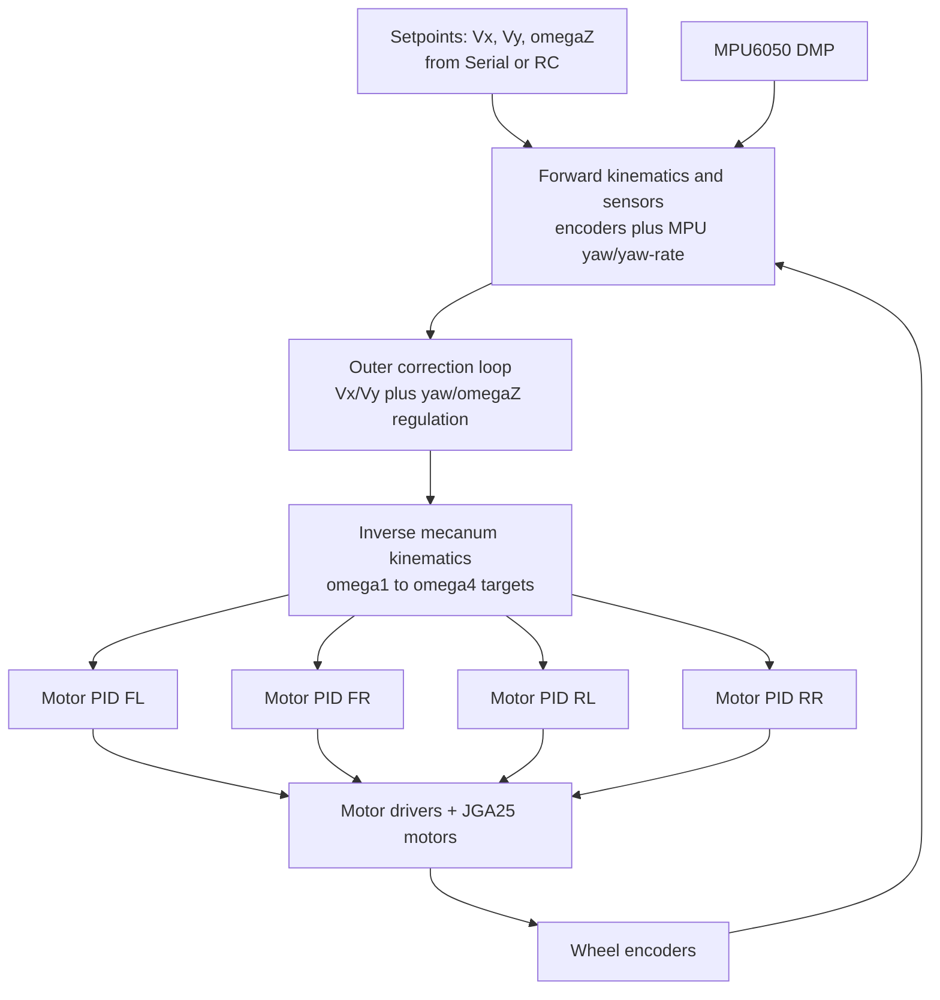
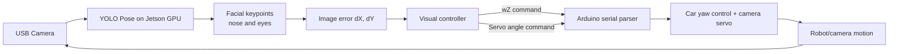

# RC Mecanum Car + Jetson Face Tracking

An end-to-end robotics project that combines:
- real-time low-level control on an Arduino Mega 2560,
- omnidirectional mecanum drive with nested control loops,
- CRSF radio link for manual operation,
- and GPU-assisted vision on a Jetson board for autonomous face tracking.

This repository is designed to showcase practical robotics engineering: embedded control, sensor fusion, kinematics, communication protocols, and vision-based actuation.

---

## 1) Project Overview

The system is split into two tightly coupled layers:

- **Embedded control layer (Arduino, in `arduino/rc_control/`)**
  - Reads wheel encoders and IMU data.
  - Runs mecanum forward/inverse kinematics.
  - Runs nested feedback loops:
    - wheel-speed PID per motor,
    - velocity/yaw correction loop on top.
  - Accepts commands from:
    - CRSF radio transmitter (manual mode),
    - serial commands from Jetson (autonomous mode).

- **Perception + high-level behavior layer (Jetson, in `source/car_core.py`)**
  - Runs a YOLO pose model on GPU (`ultralytics` + CUDA).
  - Extracts facial keypoints (nose + eyes) and computes image-space errors.
  - Closes a visual servoing loop:
    - yaw command (`wZ`) to turn the base toward the face,
    - camera tilt servo command to keep the face vertically centered.

---

## 2) Hardware/Tech Stack

### Main compute and control
- **Arduino Mega 2560** for deterministic motor/sensor control and RC decoding.
- **NVIDIA Jetson** as master for perception and autonomy logic.

### Mobility platform
- **4x JGA25 DC gear motors with quadrature encoders** (mecanum drive base).
- **Mecanum wheels** for omnidirectional motion (`Vx`, `Vy`, `omegaZ`).
- **H-bridge style motor actuation** with direction + PWM per motor.

### Sensing and communication
- **MPU6050 IMU** using DMP/quaternion pipeline (`Simple_MPU6050` library).
- **CRSF (Crossfire) receiver** via `CrsfSerial` for low-latency RC channels.
- **Pin change interrupts** for high-rate encoder tick counting.
- **USB serial link** between Jetson and Arduino for high-level commands.

### Vision and AI
- **OpenCV** camera capture and visualization.
- **Ultralytics YOLO pose model** (`pose_estimator_preloaded.pt`) for keypoint inference.
- **PyTorch + CUDA** acceleration on Jetson GPU.

---

## 3) Repository Structure

- `arduino/rc_control/rc_control.ino`: main real-time control loop, RC handling, MPU callback, serial parser, servo control.
- `arduino/rc_control/Car.cpp` + `Car.h`: mecanum kinematics + body-level corrections (`Vx`, `Vy`, yaw/omegaZ).
- `arduino/rc_control/Motor.cpp` + `Motor.h`: per-wheel speed estimation and PID to PWM.
- `arduino/rc_control/MPU_handler.cpp`: yaw/yaw-rate estimation helper from DMP outputs.
- `source/car_core.py`: Jetson-side face tracking, control command generation, serial protocol.
- `models/`: expected location for trained pose model weights.

---

## 4) Embedded Control Architecture (Arduino)

### 4.1 Real-time loop scheduling

In `rc_control.ino`, multiple rates are coordinated:
- **Sampling loop**: encoder speed updates (`SAMPLING_FREQUENCY = 100 Hz`).
- **Control loop**: kinematics + PID updates (`PID_FREQUENCY = 10 Hz`).
- **Display/telemetry loops** at lower rates for LCD/serial output.

The IMU path is event-driven by FIFO updates (`mpu.on_FIFO(update_handler)`), while encoder counts are updated through pin-change interrupts.

### 4.2 CRSF manual control (Crossfire)

`RC_callback()` decodes channels and maps normalized sticks to motion commands:
- throttle/roll/pitch/yaw normalized to `[-100, 100]`,
- arm/disarm and mode switches from auxiliary channels,
- mecanum wheel PWM mixing in manual mode.

This gives a robust teleoperation path with low-latency radio control.

### 4.3 IMU integration (MPU6050)

The code uses quaternion-to-Euler conversion to recover yaw from the DMP stream:
- `get_yaw(...)` extracts yaw angle in degrees.
- `MPU_handler` smooths yaw samples and computes yaw rate (`rad/s`).

In `Car::forward_kinematics()`, body yaw and yaw-rate come from IMU, while linear components come from wheel odometry.

### 4.4 Mecanum kinematics and cascaded control

The control architecture is intentionally **nested**:

1. **Outer body-level correction loop** (`Car::update_velocity_PID`)
   - Computes velocity errors (`Vx`, `Vy`) and heading/yaw regulation.
   - If explicit `omegaZ` setpoint is present, it tracks yaw-rate directly.
   - Otherwise it performs heading hold on yaw (`target_yaw - yaw`) with PI behavior.

2. **Inverse kinematics** (`Car::inverse_kinematics`)
   - Converts corrected body commands into four wheel angular setpoints.

3. **Inner wheel loops** (`Motor::PID_controller`)
   - For each JGA25 motor:
     - measures angular speed from encoder ticks,
     - applies PID + feedforward (`linear_pwm_command` polynomial),
     - constrains PWM and applies direction/PWM output.

4. **Actuation**
   - `send_PID_input()` sends bounded updates to each wheel.

This architecture is exactly what is expected in practical mobile robotics: stable high-level behavior with fast local wheel loops.

---

## 5) Control Loop Diagrams

### 5.1 Nested loops on Arduino (motion control)

### 5.2 Vision-to-actuation loop on Jetson + Arduino

---

## 6) Jetson Face Tracking Pipeline

The master logic is implemented in `source/car_core.py`.

### 6.1 Model inference
- Loads a pose model with `ultralytics.YOLO(...).to('cuda')`.
- Captures frames from camera (`cv2.VideoCapture(0)`).
- Runs keypoint inference each frame.

### 6.2 Feature extraction
- Selects one tracked person (`filter_keypoints`), prioritizing confidence and keypoint consistency.
- Uses:
  - nose keypoint,
  - left and right eye keypoints.
- Computes errors relative to image center:
  - `dX`: horizontal offset,
  - `dY`: vertical offset.

### 6.3 Visual servoing behavior
- Horizontal error (`dX`) is converted to angular velocity command `wZ` (base yaw correction).
- Vertical error (`dY`) is converted to servo angle correction for camera tilt.
- Deadbands (`threshold_dX`, `threshold_dY`) reduce jitter.
- If face is lost for several frames, fallback behavior sends random servo angles and neutral yaw to reacquire target.

### 6.4 Serial protocol with Arduino
- Jetson sends compact command strings:
  - `X...` for `Vx`,
  - `Y...` for `Vy`,
  - `Z...` for `omegaZ`,
  - `S...` for camera servo angle.
- Arduino `parseString(...)` applies those values to the motion setpoints and servo.

---

## 7) Quick Start (Developer Notes)

### Arduino side
1. Open `arduino/rc_control/rc_control.ino` in Arduino IDE.
2. Target board: **Arduino Mega 2560**.
3. Ensure required libraries are available (`CRSF`, `Simple_MPU6050`, `PinChangeInterrupt`, `Servo`, etc.).
4. Upload firmware and verify serial output includes `setup end`.

### Jetson side
1. Install Python dependencies (OpenCV, torch, ultralytics, pyserial).
2. Place pose model weights at `models/pose_estimator_preloaded.pt`.
3. Run:
   - `python3 source/car_core.py`
4. Verify serial connection to `/dev/ttyACM*` and camera availability.

---

## 8) Current Notes / Improvement Opportunities

- Formalize dependency management (`requirements.txt`) for reproducible setup.
- Add gain-tuning guide and known-good PID values for multiple battery states.
- Add benchmark metrics (latency, tracking FPS, heading error, velocity error).
- Add unit/integration tests for serial parsing and control safety guards.

---

## 9) Safety Disclaimer

This is an experimental robotics platform. Validate each subsystem independently, use hardware e-stop strategies, and test with wheels lifted/off-ground before full-motion trials.
