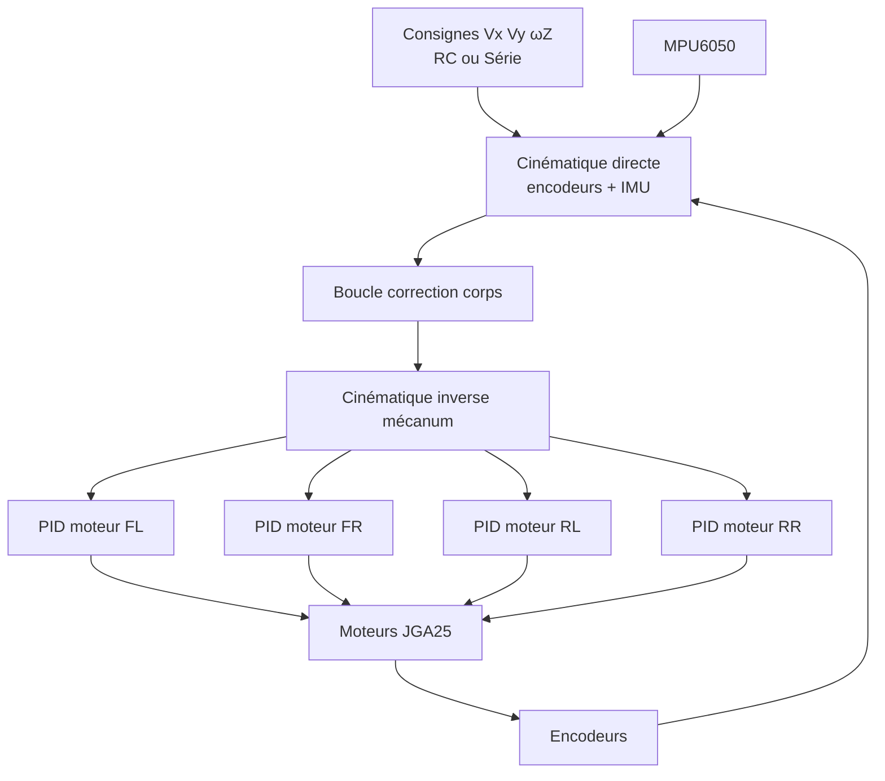
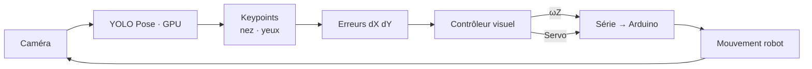

# RC Mecanum Car — Suivi facial autonome

> Véhicule omnidirectionnel à roues mécanum, télécommandé en radio ou piloté en autonomie par vision sur GPU.

Projet de robotique mobile **de bout en bout** : contrôle embarqué temps réel, cinématique omnidirectionnelle, fusion capteurs, et suivi de visage par IA embarquée sur Jetson.

---

## En bref

Le système repose sur **deux couches couplées** :

| Couche | Matériel | Rôle |
|--------|----------|------|
| **Contrôle bas niveau** | Arduino Mega 2560 | Moteurs, encodeurs, IMU, décodage radio RC |
| **Perception & comportement** | NVIDIA Jetson | Détection de visage, génération des consignes de mouvement |

**Deux modes de fonctionnement :**

- **Manuel** — télécommande radio CRSF (Crossfire), sticks mappés en vitesses mécanum (`Vx`, `Vy`, `ωZ`)
- **Autonome** — la caméra détecte un visage et ajuste en continu l'orientation du châssis et l'inclinaison de la caméra pour le garder centré dans l'image

---

## Composants principaux

| | | |
|:---:|:---:|:---:|
|  |  |  |
| **Arduino Mega 2560** — contrôle temps réel | **Jetson Nano** — perception & IA | **MPU6050** — IMU (yaw, lacet) |

| | | |
|:---:|:---:|:---:|
|  |  |  |
| **JGA25 + roue mécanum** — 4× moteurs encodés | **Caméra USB** — capture & tracking | **Taranis X-Lite** — téléop CRSF |

| |
|:---:|
|  |
| **Pack 18650** — alimentation embarquée |

---

## Compétences mises en œuvre

| Domaine | Réalisations |
|---------|-------------|
| **Robotique mobile** | Cinématique directe / inverse mécanum, boucles PID emboîtées (roue → corps) |
| **Embarqué temps réel** | Boucles multi-fréquences, interruptions encodeurs, IMU DMP |
| **Téléopération** | Décodage protocole CRSF, mapping sticks → consignes de vitesse |
| **Vision par ordinateur** | Détection de pose YOLO, extraction de keypoints faciaux, servoing visuel |
| **Edge AI** | Inférence GPU sur Jetson (PyTorch + CUDA, Ultralytics) |
| **Intégration système** | Protocole série Jetson ↔ Arduino, commutation manuel / autonome |

---

## Matériel & stack

### Plateforme

- **4× moteurs JGA25** avec encodeurs quadrature — base mécanum omnidirectionnelle
- **Ponts H** — direction + PWM par moteur
- **MPU6050** — IMU avec pipeline DMP (quaternion → yaw, taux de lacet)
- **Récepteur CRSF** — liaison radio basse latence pour la téléopération
- **Servo caméra** — inclinaison verticale indépendante du châssis

### Calcul & logiciel

| Composant | Technologie |
|-----------|-------------|
| Contrôle embarqué | Arduino Mega 2560, C++ |
| Perception | NVIDIA Jetson, Python |
| Vision | OpenCV, Ultralytics YOLO pose |
| Accélération IA | PyTorch, CUDA |
| Liaison inter-cartes | USB série (`/dev/ttyACM*`) |

---

## Architecture système

```
┌──────────────────────────────────────────────────────────────┐
│                         JETSON                               │
│                                                              │
│   Caméra USB ──► YOLO Pose (GPU) ──► keypoints visage        │
│                         │                                    │
│                         ▼                                    │
│              erreurs dX / dY (centre image)                  │
│                         │                                    │
│                         ▼                                    │
│              consignes ωZ + angle servo caméra                 │
└──────────────────────────┬───────────────────────────────────┘
                           │ USB série  (X, Y, Z, S)
┌──────────────────────────▼───────────────────────────────────┐
│                      ARDUINO MEGA                              │
│                                                                │
│   CRSF (manuel) ──┐                                            │
│                   ├──► consignes Vx, Vy, ωZ                    │
│   Série (auto) ───┘           │                                │
│                               ▼                                │
│              cinématique directe (encodeurs + IMU)             │
│                               │                                │
│                               ▼                                │
│              boucle correction corps (Vx, Vy, yaw)             │
│                               │                                │
│                               ▼                                │
│              cinématique inverse → 4 vitesses roues          │
│                               │                                │
│                               ▼                                │
│              4× PID moteur → PWM + direction                 │
└────────────────────────────────────────────────────────────────┘
```

---

## Contrôle embarqué (Arduino)

Le firmware (`arduino/rc_control/`) gère l'ensemble du contrôle bas niveau avec des **boucles à fréquences différenciées** :

| Boucle | Fréquence | Rôle |
|--------|-----------|------|
| Échantillonnage encodeurs | 100 Hz | Estimation vitesse angulaire par roue |
| Contrôle PID | 10 Hz | Cinématique + correction + actuation |
| IMU | événementiel | Mise à jour yaw / taux de lacet (FIFO DMP) |

### Boucles emboîtées

Le contrôle est organisé en **deux niveaux** :

1. **Boucle externe (corps)** — régule les vitesses `Vx`, `Vy` et le cap / taux de lacet `ωZ` à partir de l'odométrie roues + IMU
2. **Boucle interne (roues)** — 4 PID indépendants convertissent les consignes de vitesse angulaire en PWM moteur, avec modèle feedforward



### Téléopération CRSF

Les sticks de la radio sont normalisés sur `[-100, 100]` et convertis en consignes mécanum. Des canaux auxiliaires gèrent l'armement et le basculement de mode.

---

## Suivi facial (Jetson)

Le script `source/car_core.py` implémente la boucle de **servoing visuel** :

### Pipeline

1. **Capture** — flux caméra USB via OpenCV
2. **Inférence** — modèle YOLO pose (`pose_estimator_preloaded.pt`) sur GPU
3. **Sélection** — filtrage du sujet principal (confiance + cohérence des keypoints)
4. **Extraction** — nez + yeux → calcul des écarts `dX` (horizontal) et `dY` (vertical) par rapport au centre image
5. **Commande** — conversion en `ωZ` (rotation châssis) et angle servo (inclinaison caméra)
6. **Envoi** — protocole série compact vers l'Arduino (`Z...` pour ωZ, `S...` pour le servo)



Des **zones mortes** (`threshold_dX`, `threshold_dY`) limitent les oscillations. En cas de perte de cible, un comportement de recherche relance l'acquisition.

---

## Structure du repo

| Fichier / dossier | Description |
|-------------------|-------------|
| `arduino/rc_control/rc_control.ino` | Boucle principale, RC, IMU, parser série, servo |
| `arduino/rc_control/Car.cpp` | Cinématique mécanum + correction corps |
| `arduino/rc_control/Motor.cpp` | PID par roue, estimation vitesse encodeur |
| `arduino/rc_control/MPU_handler.cpp` | Extraction yaw / taux de lacet depuis le DMP |
| `source/car_core.py` | Tracking facial, génération commandes, liaison série |
| `models/` | Poids du modèle YOLO pose |

---

## Démo

<!-- Lien vidéo ou GIF -->
`[Vidéo démo](docs/demo.mp4)` · `[GIF tracking](docs/demo.gif)`

---

*Projet expérimental — chaque sous-système validé indépendamment, tests initiaux avec roues levées.*
